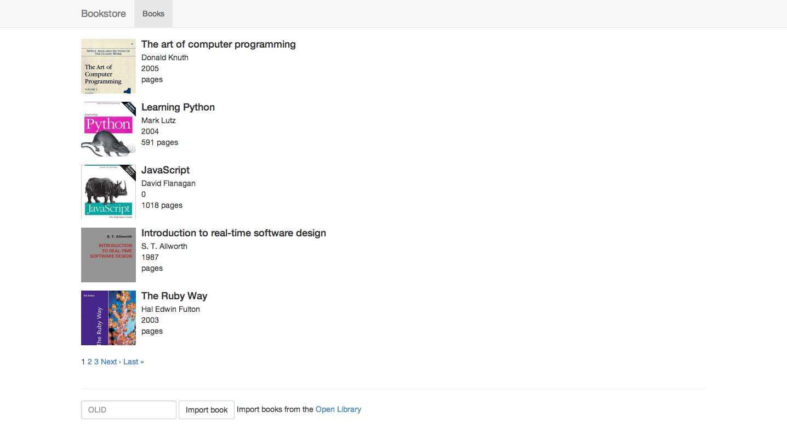
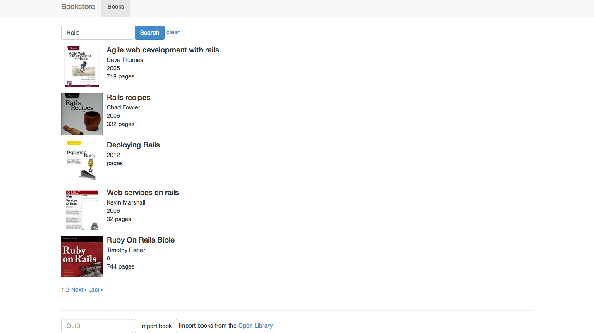
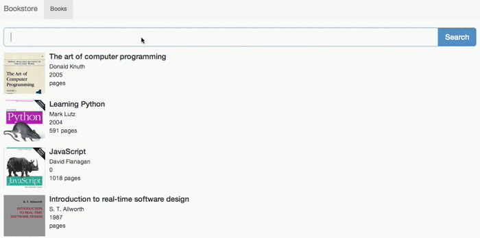

This post will show a fast and easy way to add search to your Rails application.
We will use [Elasticsearch](http://www.elasticsearch.org/), an open source
search engine, and [Searchkick](http://ankane.github.io/searchkick/), an
easy-to-use gem that integrates Elasticsearch with Rails. READMORE

## Installing Elasticsearch

To get started, you need to install Elasticsearch. Mac users can use
[Homebrew](http://brew.sh/) for that - simply run `brew install elasticsearch`
and follow the instructions. Alternatively, you can refer to the
[Elasticsearch setup guide](http://www.elasticsearch.org/guide/en/elasticsearch/reference/current/setup.html).

## Example Application

The code for an example application we'll be working with can be found
[on Github](https://github.com/grk/bookstore-example/). If you want to follow
the changes step-by-step on your machine, you can start with the
[before-search branch](https://github.com/grk/bookstore-example/tree/before-search).

After importing some books, we end up with a basic listing of books with
their covers, paginated:

<figure>
  
</figure>

## Adding Search

With that as a base application, we can start working on adding search. The
first step is adding searchkick to the Gemfile:

```ruby
# Gemfile
gem "searchkick"
```

After running `bundle install`, we can configure the Book model to be
searchable:

```ruby
# app/models/book.rb
class Book < ActiveRecord::Base
  searchkick
  # ...
end
```

Next, we need to build the index for the Book class so that the books we already
have in the database will be added to Elasticsearch. When new records are
created rebuilding isn't necessary, but you have to do it whenever you change
the `searchkick` method in your model:

```bash
rake searchkick:reindex CLASS=Book
```

After that, we can try the search in the rails console:

```
2.0.0-p247 :001 > results = Book.search("ruby")
 => #&lt;Searchkick::Results:0x007ff5a1bca158 ...
2.0.0-p247 :002 > results.map(&:title)
  Book Load (0.5ms)  SELECT "books".* FROM "books" WHERE "books"."id" IN (10, 9, 11)
 => ["Programming Ruby", "The Ruby Way", "Ruby On Rails Bible"]
```

Now that our search is working, we can integrate it with the books controller:

```ruby
# app/controllers/books_controller.rb
class BooksController < ApplicationController
  def index
    if params[:query].present?
      @books = Book.search(params[:query], page: params[:page])
    else
      @books = Book.all.page params[:page]
    end
  end

  # ...
end
```

And add the search form in the view:

```slim
# app/views/books/index.html.slim
= form_tag books_path, class: "form-inline", method: :get do
  .form-group
    = text_field_tag :query, params[:query], class: "form-control"
  '
  = submit_tag "Search", class: "btn btn-primary"
  - if params[:query].present?
    '
    = link_to "clear", books_path
```

With that change, we can search our bookstore using the form we just added:

<figure>
  
</figure>

You can check the code up to this point at the
[simple-search branch](https://github.com/grk/bookstore-example/tree/simple-search)
on Github.

## Autocomplete

One of the most useful features of any search engine is autocomplete. Luckily
for us, searchkick provides a really easy way to do that. On the browser side,
we can use the awesome [typeahead.js library](http://twitter.github.io/typeahead.js/)
from Twitter.

We'll add this library in the application layout (because it's faster), but for
production apps you should add it to your Asset Pipeline. You could use
[Bower](https://github.com/bower/bower) for that, and we posted
[a guide for using Bower with Rails](/blog/2013/09/how-to-manage-front-end-packages-in-rails-with-bower)
a while ago.

```
# app/views/layouts/application.html.slim
= javascript_include_tag "//cdnjs.cloudflare.com/ajax/libs/typeahead.js/0.9.3/typeahead.min.js"
```

Next, we change the searchkick setup in our Book model to include autocomplete:

```ruby
# app/models/book.rb
class Book < ActiveRecord::Base
  searchkick autocomplete: ['title']
  # ...
end
```

As mentioned before, this change requires rebuilding the index, so we run

```
rake searchkick:reindex CLASS=Book
```

To confirm that the autocomplete is working, let's try it in the Rails console:

```
2.0.0-p247 :001 > Book.search("the", autocomplete: true).map(&:title)
  Search (7.5ms)  {"query":{"multi_match":{"fields":["title.autocomplete"],"query":"the","analyzer":"searchkick_autocomplete_search"}},"size":100000,"from":0,"fields":[]}
  Book Load (0.8ms)  SELECT "books".* FROM "books" WHERE "books"."id" IN (9, 12, 5)
 => ["The Ruby Way", "The Art of Rails", "The  art of computer programming"]
```

Since it's working as expected, we can add an action to our books controller
that will return the autocomplete results:

```ruby
# app/controllers/books_controller.rb
class BooksController < ApplicationController
  def autocomplete
    render json: Book.search(params[:query], autocomplete: true, limit: 10).map(&:title)
  end
end
```

Remember to add a route for this new action:

```ruby
# config/routes.rb
Bookstore::Application.routes.draw do
  resources :books, only: :index do
    collection do
      post :import
      get :autocomplete # <= add this line
    end
  end
  root to: 'books#index'
end
```

Now, we can add autocomplete to the search form. First, let's add some nicer
styling:

```
# app/views/books/index.html.slim
= form_tag books_path, class: "form-inline", method: :get do
  .input-group.input-group-lg
    - if params[:query].present?
      .input-group-btn
        = link_to "clear", books_path, class: "btn btn-default"
    = text_field_tag :query, params[:query], class: "form-control", id: "book_search", autocomplete: "off"
    .input-group-btn
      = submit_tag "Search", class: "btn btn-primary"
```

Note that we added the `book_search` id to the query input. All that's left is
wiring up the javascript to fetch the autocomplete results:

```coffeescript
# app/assets/javascripts/books.js.coffee
$ ->
  $('#book_search').typeahead
    name: "book"
    remote: "/books/autocomplete?query=%QUERY"
```

We're missing some styling for typeahead, which you can download from
[here](https://raw.github.com/grk/bookstore-example/master/app/assets/stylesheets/typeahead.css)
and put in app/assets/stylesheets/typeahead.css.

The result should look like this:

<figure>
  
</figure>

## Deploying Elasticsearch

If you're deploying your app on your own infrastructure, you can use this
[chef cookbook](https://github.com/elasticsearch/cookbook-elasticsearch). There
is an official [Elasticsearch guide](http://www.elasticsearch.org/tutorials/deploying-elasticsearch-with-chef-solo/)
for deploying using chef-solo.

For cloud deployments, you can use [bonsai](http://www.bonsai.io/),
[found](http://www.found.no/) or [searchly](http://www.searchly.com/).

If you're using Shelly Cloud, adding Elasticsearch is as easy as
[adding one line to your Cloudfile](/documentation/elasticsearch).

## Further improvements

The example given in this post is very basic. Adding functionality is left
as an excercise for the reader, but I suggest looking into
[facets](http://www.elasticsearch.org/guide/en/elasticsearch/reference/current/search-facets.html)
and [suggestions](http://www.elasticsearch.org/guide/en/elasticsearch/reference/current/search-suggesters.html).
Both of those features will improve the usability of your app and delight
your users.
