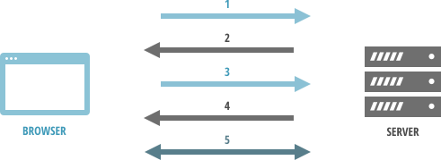

## What is SSL/TLS?
Secure Sockets Layer (SSL) and its successor Transport Layer Security (TLS) are
cryptographic protocols designed to provide secure connection between a server
and a client, typically a web server and a browser or a mail server and a mail
client. READMORE

SSL protocol defines the structure of the data transfered and the procedure to
establish an encrypted connection, it also makes sure of the integrity of the
data.

Normally, data is sent between browsers and web servers in plain text,
which is vulnerable to eavesdropping. SSL allows sensitive information such
as credit card numbers, user names and passwords, personal details to be
transmitted securely.

SSL is used on a daily basis. Internet users recognize secure connection in
browsers by a padlock icon next to the website address or a green address bar
that comes with extended validation certificates. SSL secured websites also
begin with https.

## What is an SSL certificate

An SSL certificate consists of a public and a private key. Those two keys are used
to establish a secure connection. The certificate contains information about
the issuer, subject, which is the identity of the website owner, and the
validity of the certificate.

### Certificate Authority

SSL certificates are signed by Certificate Authority (CA), after verifying
identity of an applicant. Depending on the certificate type Certificate
Authority might require different forms of validation. For domain validated
certificate ownership of the domain has to be proven. In case of Extended
validation certificates require verification of the legal, physical and
operational existence of the requesting entity, as well as it has exclusive
right to use the domain.

All Internet browsers are capable of interacting with secured websites using SSL
protocol. Many Certificate Authorities have their root certificates embedded
in browsers so your web browser automatically trusts them. They will sign an
entity’s certificate using their trusted root certificate (or an intermediate
of it) to create a "chain of trust" so the browser will trust the entity’s
certificate.

A Certificate Authority will need a Certificate Signing Request to sign your
SSL certificate.

### Certificate Signing Request

To get a certificate you need to generate a Certificate Signing Request (CSR)
which contains all information that will be included in your certificate such
as your organization name, domain name, locality and country. It also contains
the public key that will be included in your certificate. A private key is
usually created at the same time that you create the CSR.

The following command will generate a 2048-bit RSA private key with a CSR.

```
$ openssl req -new -newkey rsa:2048 -nodes -keyout <em>server.key</em> -out <em>server.csr</em>
...
<span class="output">Country Name (2 letter code) [AU]:</span> <em>PL</em>
<span class="output">Common Name (e.g. server FQDN or YOUR name) []:</span> <em>shellycloud.com</em>
...
```

Created CSR <code>server.csr</code> can be sent to a Certificate Authority of
your choice, to sign your certificate. Make sure to keep your private key
secret and safe. The certificate created with a particular CSR will only work
with the private key that was generated with it. So if you lose the private
key, the certificate will no longer work.

## Secure connection with a SSL certificate

When a browser attempts to access a website that is secured by SSL, the
browser and the web server establish a secure connection using a process
called SSL Handshake. This process is responsible for specifying encryption
methods and keys that will be used for the remainder of the communications.
SSL Handshake is transparent to the end user and happens instantaneously.

SSL Handshake uses asymmetric cryptography as well as the symmetric cryptography.
Asymmetric cryptography uses two separate keys, one public and one private. Public
key is used for encryption or verification of a digital signature. Private key
is used for decrypting or creating digital signature. Symmetric cryptography uses
the same key for both encryption and decryption.

SSL Handshake uses your certificate's public and private key, and a session key
which is generated during that process. Asymmetric cryptography takes more processing power, therefore your public and private key are used only to
create a symmetric session key.

<figure>
  
</figure>

1. Browser makes a request to a secure page with https.
2. Web server sends its SSL Certificate, its public key.
3. Browser ensures that the certificate is valid, was issued by a trusted
Certificate Authority and that its common name is valid for the website that
it is connecting to. If the browser trusts the certificate it creates
a symmetric session key using server's public key and sends it back.
4. Symmetric session key is decrypted with the private key and web server sends
back an acknowledgment encrypted with the session key to start the encrypted
session.
5. Web server and browser encrypts all transmitted data with the session key.

## Why you should use SSL?

One of the most important factors of creating a successful on-line business is
trust of customers. One of the way to accomplish this is by securing your
website with SSL Certificates, making sure that all your customer data, logins,
passwords, personal information, are transmitted safely between your web server
and user browsers.

## Installing SSL certificates

Installing an SSL certificate will vary depending on the type of the web server.
In case of Nginx web server installation will look as follows:

1. Copy SSL certificate and key to your Nginx server
2. Configure Nginx Server Block

    ```bash
      server {
        listen                    443 ssl;
        server_name               www.example.com;
        ssl_certificate           /path/to/www.example.com.crt;
        ssl_certificate_key       /path/to/www.example.com.key;
        ssl_protocols             SSLv3 TLSv1 TLSv1.1 TLSv1.2;
        ssl_ciphers               'recommended ciphersuite, see below'
        ssl_prefer_server_ciphers on;
        ssl_session_cache         shared:SSL:50m;
        ...
      }
    ```

3. Confirm that your Nginx configuration is correct and reload your server

    ```bash
    # nginx -t
    nginx: the configuration file /etc/nginx/nginx.conf syntax is ok
    nginx: configuration file /etc/nginx/nginx.conf test is successful

    # /etc/init.d/nginx reload
    [ ok ] Reloading nginx configuration: nginx.
    ```

4. Verify your website using [SSL testing suite](https://www.ssllabs.com/ssltest)

### Recommended ciphersuite

Using the proper ciphersuite is very important. Specifying SSL protocols and
used ciphers ensures that SSL attacks like CRIME, LUCKY13, BEAST are mitigated.
We encourage to use [Mozilla recommended cipersuite](https://wiki.mozilla.org/Security/Server_Side_TLS#Recommended_Ciphersuite).

### Shelly Cloud users

If your a Shelly Cloud user, adding an SSL certificate to your application will
be as easy as [issuing one command with shelly utility](/documentation/ssl_support).
