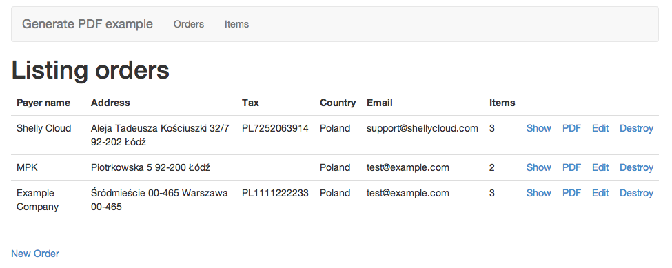
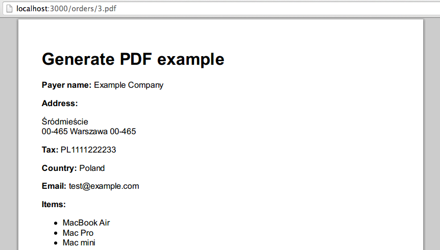
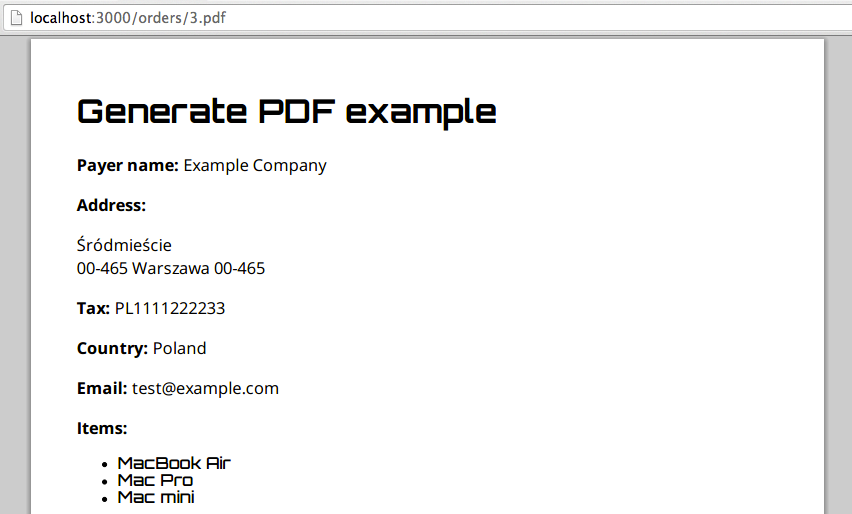

Generating PDF files with custom fonts can be tricky. In this tutorial we
will create a simple Rails app and tackle this problem with two tools:
[wicked_pdf] (https://github.com/mileszs/wicked_pdf) and
[wkhtmltopdf] (https://code.google.com/p/wkhtmltopdf/). READMORE

## Example application

The code for an example application we'll be working with can be found
[on Github] (https://github.com/sabcio/generate_pdf). It's a minimalistic app
to create sales orders. It was created with
[Rails Composer] (http://railsapps.github.io/rails-composer), to start off
fast.

After importing some orders and items with `rake db:seed`, we can review
them:

<figure>
  
</figure>

## Generating PDF files

We will be using wicked_pdf to generate PDF files. Wicketd_pdf is a wrapper
around shell utility wkhtmltopdf, which serves PDF files from plain HTML.
Wicked_pdf doesn't require us to use any specific DSL to create PDF files.
Instead it utilizes HTML views that we, Rails developers, are accustomed
to. Wicked_pdf requires installed wkhtmltopdf, luckily there is a binary
version released as a gem, that works on Linux, Mac OS X and Windows.
We can start off by adding wicked_pdf and wkhtmltopdf-binary to `Gemfile`:

```ruby
# Gemfile

gem 'wkhtmltopdf-binary'
gem 'wicked_pdf'
```

After running `bundle install`, we can move on to adding support for PDF format
in `OrdersController`:

```ruby
# app/controllers/orders_controller.rb

def show
  respond_to do |format|
    format.html
    format.pdf do
      render pdf: @order.payer_name,                  # file name
             layout: 'layouts/application.pdf.haml',  # layout used
             show_as_html: params[:debug].present?    # allow debuging
    end
  end
end
```

Wicked_pdf [supports many more options] (https://github.com/mileszs/wicked_pdf#advanced-usage-with-all-available-options),
we can easily start off with these three. Let's create a layout for our PDF
files:

```ruby
# app/views/layout/application.pdf.haml

!!!
%html
  %head
    %meta{charset: 'utf8'}

  %body
    .container
      %h1 Generate PDF example
      = yield
```

We still have to create a show view for PDF format (copied from scaffold HTML
version):

```ruby
# app/views/orders/show.pdf.haml

%p
  %b Payer name:
  = @order.payer_name
%p
  %b Address:
  = simple_format(@order.address)

# the rest is omitted for brevity
```

If we navigate to our first order and add `.pdf` extension to the URL, we will see
the first generated PDF:

<figure>
  
</figure>

Great, we didn't add so much code and we are able to generate PDF files. What if
we want to use custom fonts?

## Adding custom fonts

I have picked [Open Sans] (http://www.google.com/fonts/specimen/Open+Sans) and
[Orbitron] (http://www.google.com/fonts/specimen/Orbitron) fonts, both
downloaded from [Google Fonts] (http://www.google.com/fonts).

To use them in our PDF we have to create a CSS file:

```css
# app/assets/stylesheets/pdf.css.scss

h1, li{
  font-family: 'Orbitron';
}

p{
  font-family: 'Open Sans';
}
```

And include it in our PDF layout with `wicked_pdf_stylesheet_link_tag`.
`wicked_pdf_*` helpers embed CSS or Javascript in the HTML output, which is
then used to generate PDF with wkhtmltopdf.

```ruby
# app/views/layout/application.pdf.haml

!!!
%html
  %head
    %meta{charset: 'utf8'}
+   = wicked_pdf_stylesheet_link_tag "pdf"

  %body
    .container
      %h1 Generate PDF example
      = yield
```

We still need to add these fonts in our operating system, it may vary
depending on what OS you are using. In case of Mac OS X you can add them via
native Font Book app. In Ubuntu installing fonts is either done by double
clicking or by adding them to `~/.fonts` or `/usr/share/fonts` directories
and rebuilding fonts cache with `fc-cache`.

Let's try to generate the PDF again:

<figure>
  
</figure>

Fonts are rendered correctly! We can deploy our application to production.

## Deploying on Shelly Cloud

We have installed fonts on our local machine. If we [deploy our application
to Shelly Cloud] (https://shellycloud.com/documentation/quick_start), we will
notice that our neat fonts are gone. This is because
they are missing on Shelly Cloud's virtual servers.

To keep our fonts in one place, we can add them to `app/assets/fonts`
directory. To make sure they are always present on our virtual servers
we will create a [before_restart hook] (https://shellycloud.com/documentation/deployment_hooks)
with the following content:

```bash
# config/deploy/shelly/before_restart

set -e

ln -sf ~/app/current/app/assets/fonts ~/.fonts

fc-cache
```

It links `app/assets/fonts` directory to `~/.fonts` and scans the
font directories on the system to rebuild font information cache files. Now our
PDF will be generated with proper fonts. We are done.

## Other solutions

I did some research on adding fonts to wkhtmltopdf generated PDF. I found a few
other possible solutions to this problem, however none of them worked or
I had different results on development and production environments.

The first one was to add either absolute paths to fonts or URLs to external
sources. I tried both but with no luck. The HTML was correctly rendered but
the generated PDFs were actually blank.

The other solution was to encode fonts with base64 and use @font-face rule
in CSS. The only restriction was to use Truetype fonts. It worked, however there
were problems when multiple @font-face rules were specified for normal and
bold fonts. Also rendered fonts looked different, they were not clean and crisp.
I found out, on wkhtmltopdf issue tracker, that this is actually
[a qt-webkit bug](https://code.google.com/p/wkhtmltopdf/issues/detail?id=410&q=font-face).
I have created a separate
[github branch] (https://github.com/sabcio/generate_pdf/tree/base64) with the
last commit showing this technique.
