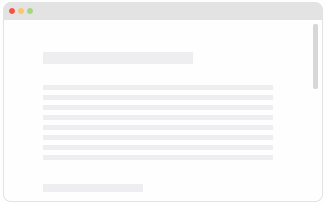

_The following article has been prepared based on AngularJS and ngAnimate
version 1.2.12, so the provided code examples may not work properly
with older or newer versions of these libraries._ READMORE

<figure>
  
</figure>

## What is ngAnimate?

ngAnimate is an efficient, well-tested and easy to use library that
simplifies adding and managing animations in all applications based on the
AngularJS framework. The extension uses native technologies,
such as CSS Transitions, CSS Animations and JS Animations, which are supported
by all modern web browsers. Therefore, using it is very simple, and there are
no major problems with implementing it in existing web applications.

There are many practical benefits of using this library. For example, it solves
the notorious problem with different animations writing over themselves when
used with the same element. It also allows for enabling or disabling
a particular animation, depending on the effect we wish to achieve.

It is worth noting that the existing directives are aware of ngAnimate's
existence, so using it requires no additional configuration and works immediately
after its installation.

## Installation

We add ngAnimate to an application via a standard HTML import:

```html
<script src="//ajax.googleapis.com/ajax/libs/angularjs/1.2.12/angular.min.js"></script>
<script src="//ajax.googleapis.com/ajax/libs/angularjs/1.2.12/angular-animate.min.js"></script>
```

And load our module as application's dependency:

```javascript
angular.module('app', ['ngAnimate']);
```

## How it works

As I mentioned, Angular's existing directives assume the existence of ngAnimate
and use the `$animate` service in their implementations. The `$animate` service
ensures the addition of appropriate CSS classes, depending on the event that
may occur for a given directive. This can be shown with a table:

<table class="table--striped">
  <thead>
    <tr>
      <th>Directive</th>
      <th>Events</th>
    </tr>
  </thead>
  <tbody>
    <tr>
      <td>ngRepeat</td>
      <td>enter, move, leave</td>
    </tr>
    <tr>
      <td>ngView</td>
      <td>enter, leave</td>
    </tr>
    <tr>
      <td>ngSwitch, ngInclude, ngIf</td>
      <td>enter, leave</td>
    </tr>
    <tr>
      <td>ngClass</td>
      <td>addClass, removeClass</td>
    </tr>
    <tr>
      <td>ngHide, ngShow</td>
      <td>addClass('.ng-hide'), removeClass('.ng-hide')</td>
    </tr>
  </tbody>
</table>

## How to use

### CSS Transitions

There are three methods of attaching an animation to a chosen element.
The simplest one is by using CSS Transitions.

Let's say that we have the following element that uses the directive `ng-show`,
and that we want the text to change color from blue to red upon calling
that directive:

```html
<a href="" ng-click="showHeader = true">Show header</a>
<h1 class="effect" ng-show="showHeader">Foo</h1>
```

The corresponding CSS will look as follows:

```css
.effect {
  color: red;
  transition: color .5s linear;
  -webkit-transition: color .5s linear;
}
.effect.ng-hide-remove {
  color: blue;
}
```

Where did `.ng-hide-remove` come from? Depending on the event, ngAnimate
adds two classes to the element for controlling the animation. The first one
is set at the start of the animation, and the second one at the end. In the case
of `ng-show`, these are respectively `.ng-hide-remove` and `.ng-hide-remove-active`.

A detailed explanation of all possible events and their corresponding classes
can be found [in a post on the blog of one of ngAnimate's authors](http://www.yearofmoo.com/2013/08/remastered-animation-in-angularjs-1-2.html).

### CSS Animations

Another method is to use CSS Animations. It has an advantage over Transitions
in that we are given the ability to define more than two animation steps,
which lets us create effects that are more complex.

For the same directive as in the previous example, the CSS animation code
to create a transition from red to green to blue will look as follows:

```css
.effect {
  color: red;
  animation: .5s rainbow;
  -webkit-animation: .5s rainbow;
}

@keyframes rainbow {
  0% { color: blue; }
  50% { color: green; }
  100% { color: red; }
}

@-webkit-keyframes rainbow {
  0% { color: blue; }
  50% { color: green; }
  100% { color: red; }
}
```

This time, we don't have to add any special classes to the styles, because
the animation's start and end are clearly defined in the animation's definition.

### JS Animations

The last method is to define the animation directly in JavaScript. We do this
via the `animation` function provided by ngAnimate. With the use of jQuery
and jQueryUI, the implementation of the same animation will look as follows:

```javascript
angular.module('app', ['ngAnimate']).animation('.effect', function() {
  return {
    removeClass: function(element, className, done) {
      if(className === 'ng-hide') {
        element.css('color', 'blue');
        $(element).animate({
          color: 'red'
        }, done);
      } else {
        done();
      }
    }
  }
});
```

## "Follow Us" box

Now that we know how to use ngAnimate, let's try employing it to build a directive
that will create us a box. This box will appear when we scroll a webpage down
to the end of an article – exactly the same way as seen on the Shelly Cloud blog.

We begin by writing the markup in HTML:

```html
<article>
  ...
</article>

<follow-us class="island">
  <h4>Follow us on Twitter!</h4>
  <a href="https://twitter.com/shellycloud" class="twitter-follow-button" data-show-count="true" data-size="large">Follow @shellycloud</a>
  <script> // https://dev.twitter.com/docs/follow-button
    !function(d,s,id){var js,fjs=d.getElementsByTagName(s)[0];if(!d.getElementById(id)){js=d.createElement(s);js.id=id;js.src="//platform.twitter.com/widgets.js";fjs.parentNode.insertBefore(js,fjs);}}(document,"script","twitter-wjs");!function(d,s,id){var js,fjs=d.getElementsByTagName(s)[0];if(!d.getElementById(id)){js=d.createElement(s);js.id=id;js.src="//platform.twitter.com/widgets.js";fjs.parentNode.insertBefore(js,fjs);}}(document,"script","twitter-wjs");
  </script>
</follow-us>
```

We create a very simple first version of the `followUs` directive:

```javascript
angular.module('app', ['ngAnimate'])
.directive('followUs', function() {
  return {
    restrict: 'E',
    replace: true,
    transclude: true,
    template: '<div class="follow-us">' +
                '<div ng-transclude></div>' +
              '</div>'
  }
});
```

Since we want the box to be hidden by default and to have a close button,
we update the template with the required elements:

```javascript
// ...
template: '<div class="follow-us" ng-show="followUs">' +
            '<a href="" ng-click="closeFollowUs()" class="close">&#x00d7;</a>' +
            '<div ng-transclude></div>' +
          '</div>'
// ...
```

The next thing to do is to implement the box's behavior. In order to do it
correctly, we need to know the article's height, the current scroll position,
and have the appropriate event assigned. When the box is closed, we also want to
save this information in the cookies. This will prevent the box from reappearing
when the user visits the webpage again. Everything looks as follows:

```javascript
angular.module('app', ['ngAnimate'])
.directive('followUs', function() {
  return {
    restrict: 'E',
    replace: true,
    transclude: true,
    template: '<div class="follow-us" ng-show="followUs">' +
                '<a href="" ng-click="closeFollowUs()" class="close">&#x00d7;</a>' +
                '<div ng-transclude></div>' +
              '</div>',
    link: function(scope, element, attrs) {
      var articleHeight = $('article').offset().top + $('article').height();

      var scrollPosition = function() {
        return $(window).scrollTop() + $(window).height()
      };

      var hasCookie = function() {
        return (document.cookie.indexOf('skipFollowUs') >= 0);
      };

      scope.closeFollowUs = function() {
        document.cookie = "skipFollowUs=1";
        scope.followUs = false;
      };

      $(window).on('scroll', function() {
        if (scrollPosition() > articleHeight && !hasCookie()) {
          scope.$apply(function(scope) {
            scope.followUs = true;
          });
        }
      });
    }
  }
});
```

Our last step is adding styles and animations. First, we implement the basic
styles that give the whole thing a proper look:

```css
.follow-us {
  position: fixed;
  bottom: 3%;
  right: 3%;
  max-width: 300px;
  z-index: 10;
}

.island {
  background: white;
  padding: 20px;
  border-radius: 3px;
  border: 1px solid rgba(0,0,0,.2);
  box-shadow: 0 0 3px rgba(0,0,0,.2);
}

.close {
  position: absolute;
  top: 3px;
  right: 3px;
}
```

All that is left for us is to add two animations. The first one that plays
when the box appears, and the second one when it's closed. In addition,
we have to ensure that our box will be visible for the entire duration
of the animation. The corresponding CSS looks as follows:

```css
@keyframes falling {
  0% {
    transform: rotateZ(0deg);
    opacity: 1;
  }

  100% {
    transform: translateY(200px) rotateZ(90deg);
    opacity: 0;
  }
}

@-webkit-keyframes falling {
  0% {
    -webkit-transform: rotateZ(0deg);
    opacity: 1;
  }

  100% {
    -webkit-transform: translateY(200px) rotateZ(90deg);
    opacity: 0;
  }
}

@keyframes sliding-from-bottom {
  0% {
    margin-bottom: -2%;
    opacity: 0;
  }

  100% {
    margin-bottom: 0;
    opacity: 1;
  }
}

@-webkit-keyframes sliding-from-bottom {
  0% {
    margin-bottom: -2%;
    opacity: 0;
  }

  100% {
    margin-bottom: 0;
    opacity: 1;
  }
}

.follow-us.ng-hide-remove {
  animation: sliding-from-bottom 300ms;
  -webkit-animation: sliding-from-bottom 300ms;
}

.follow-us.ng-hide-add {
  animation: falling 800ms both;
  -webkit-animation: falling 800ms both;
  transform-origin: top left;
  -webkit-transform-origin: top left;
}

.follow-us.ng-hide-remove, .follow-us.ng-hide-add {
  display: block !important;
}
```

## Summary

Animations are becoming an increasingly important element of web applications,
and they are sure to play one of the key roles in interface design in 2014.
The ngAnimate library makes working with them much easier, and is a virtually
indispensable component for the current users of AngularJS. This project is worth
watching and keeping up with.

To finish off, a couple of links to some additional materials on this topic:

- [Official ngAnimate documentation](http://code.angularjs.org/1.2.9/docs/api/ngAnimate)
- [Entry in the ng-newsletter dedicated to animations](http://www.ng-newsletter.com/posts/angular-animation.html)
- [Post on the blog of Matias Niemelä – one of the authors of ngAnimate](http://www.yearofmoo.com/2013/08/remastered-animation-in-angularjs-1-2.html)
- [Video about ngAnimate from the ng-conf 2014 conference](http://www.youtube.com/watch?v=hC0MpgUoui4)
