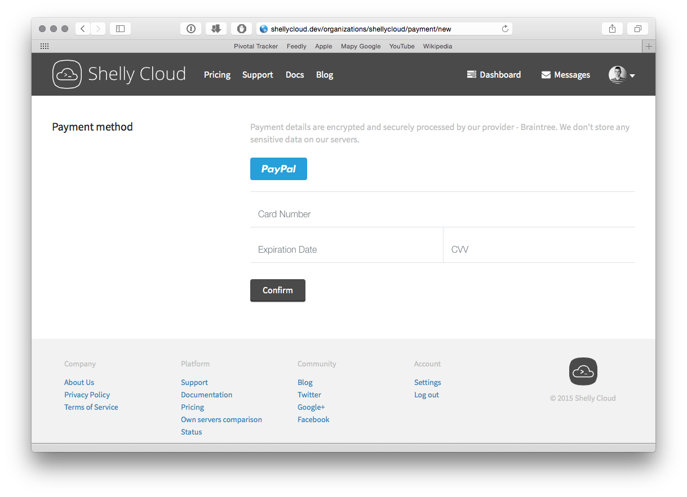

I have recently changed payment service provider to Braintree on Shelly Cloud and would love to share the experience with you. This post will show a fast and easy way of adding credit card payments to a Rails application.

## Getting Braintree account

I started off with [Braintree](https://www.braintreepayments.com/) website and signing up. As a requirement I had to provide basic info about the company as well as IDs and residential utility bills for owners. I was surprised that Braintree did not require from us to send any documents such as a translated excerpt from National Court Register, bank statements or detailed business plan of the company. We had our production account at Braintree within a couple of days, our previous payments providers should learn from them. Adding PayPal integration with a couple of clicks was also straightforward.

## Setting up Braintree

I have added [braintree](https://github.com/braintree/braintree_ruby) gem to Gemfile followed by `bundle install`.

```ruby
gem 'braintree'
```

To create a payment form Braintree Client JS SDK has to be included. It's responsible for displaying Drop-in UI - pre-formatted payment form, and for processing user credit card without accessing our server and application, for PCI DSS compliance sake.

```slim
-# slim template
= form_tag organization_payment_path(organization) do

  #dropin

  = submit_tag 'Confirm', class: 'btn push--ends'

- content_for :javascript do
  = javascript_include_tag "https://js.braintreegateway.com/v2/braintree.js"
  javascript:
    var client_token = "#{@organization.payment['client_token']}";
    braintree.setup(
      client_token,
      'dropin', {
        container: 'dropin'
      });
```

After adding those few lines of code I had a sleek payment form:

<figure>
  
</figure>

Note that the `client_token` has to be supplied to `braintree.setup` method. It contains configuration and authorization info required by JS SDK. It's unique for every customer and shouldn't be reused. The token can be generated on the server side, with the `customer_id` if the customer was already saved in the Braintree Vault and you've saved his ID.

```ruby
client_token = Braintree::ClientToken.generate(customer_id: customer_id)
```

When a customer submits a payment method, either a credit card or PayPal account, a `payment_method_nonce` is generated which is added in a hidden field to the form. The nonce has to be collected in a controller action corresponding to the form. It can be used to create a new transaction or to add a new payment method.

## Our billing model

Shelly Cloud's billing model may be different then yours. We do not charge our users upfront, our billing cycle ends at the end of the month when we issue invoices and charge accordingly. Because of that we have to save every client payment method within Braintree Vault, so when the billing cycle ends we can charge customers. Every organization on Shelly has a corresponding Braintree Customer, which contains one or more payment methods.

```ruby
def ensure_client!
  if payment_client_id.blank?
    result = Braintree::Customer.create(
      company: payer_name,
      email: receive_invoices_email
    )

    self.payment_client_id = result.customer.id
    save!
  end
end
```

Braintree Customer ID is saved in our model so we can use it later on to create a `client_token` or to charge that customer. When customer exists it is time to create a payment method with `payment_method_nonce`.

```ruby
def self.create_from_organization_and_nonce!(organization, nonce)
  result = Braintree::PaymentMethod.create(
    customer_id: organization.payment_client_id,
    payment_method_nonce: nonce,
    options: {make_default: true}
  )

  if result.success?
    pm = result.payment_method
    create!(
      card_type:    pm.try(:card_type),
      expire_month: pm.try(:expiration_month),
      expire_year:  pm.try(:expiration_year),
      last4:        pm.try(:last_4),
      organization: organization,
      provider_id:  pm.token,
      email:        pm.try(:email),
      type:         pm.class.to_s.gsub(/^.*::/, '')
    )
  else
    raise RuntimeError.new("Payment Method failed for #{organization.id}:#{organization}")
  end
end
```

We store some details about the payment method provided by user, it's credit card type, expiration year and month, last four digits and email in case of PayPal account. We expect that Braintree API works all the time, so in case of any failure a `RuntimeError` is raised. If you're familiar with Paymill payments provider you might have noticed that there is no preauthorization step, that is because Braintree as a part of AVS/CVV validation, creates $0 or $1 transactions which are automatically voided.

Now with a customer and a payment method stored in Braintree Vault we can charge customers at the end of every billing cycle. In our case `Braintree::Transaction.sale` method takes `customer_id`.

```ruby
def charge_with_braintree(euro_value, invoice_number)
  result = Braintree::Transaction.sale({
    amount: euro_value,
    customer_id: payment_client_id,
    options: {
       submit_for_settlement: true
    },
    order_id: "Shelly Cloud #{invoice_number}"
  })

  unless result.success?
    raise RuntimeError.new('Transaction failed with status "%s"' % result.transaction.status)
  end
end
```

Note that if you have a different payment flow, like one time payments, you would have to pass the `payment_method_nonce` as a parameter.

# Is that all?

If you need to accept credit card or PayPal payments fast, without unnecessary paperwork, then it is all it takes. Braintree SDK is simple and intuitive, contains much more features than described above. Things I didn't mention are:

* custom payment forms with [Hosted Fields](https://www.braintreepayments.com/features/hosted-fields)
* recurring billing with plans and subscriptions
* additional payment types

So when you start adding payments on your website be sure to check out their great [docs](https://developers.braintreepayments.com/javascript+ruby/guides/overview).
