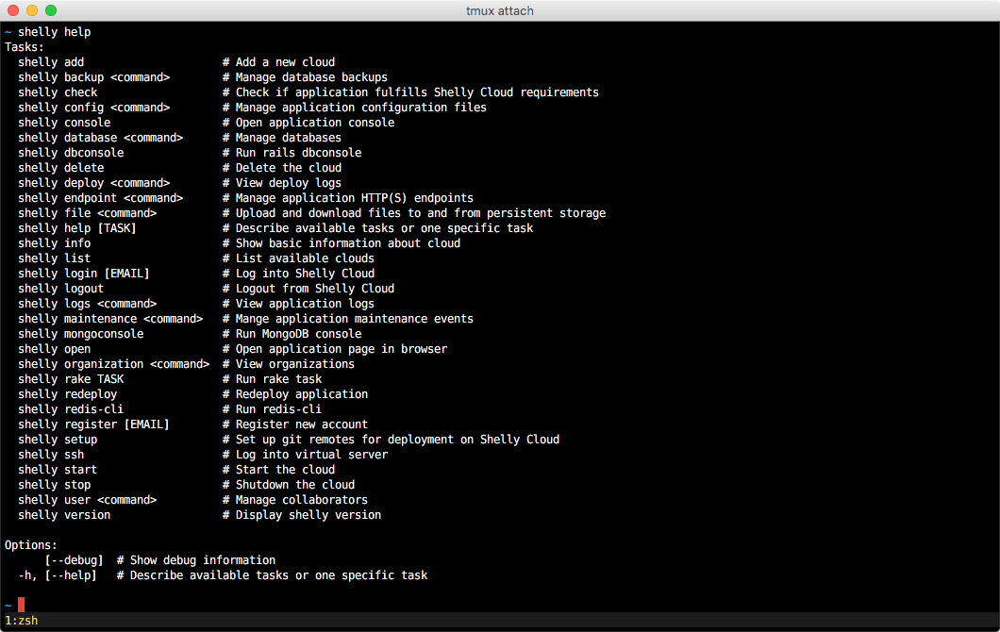
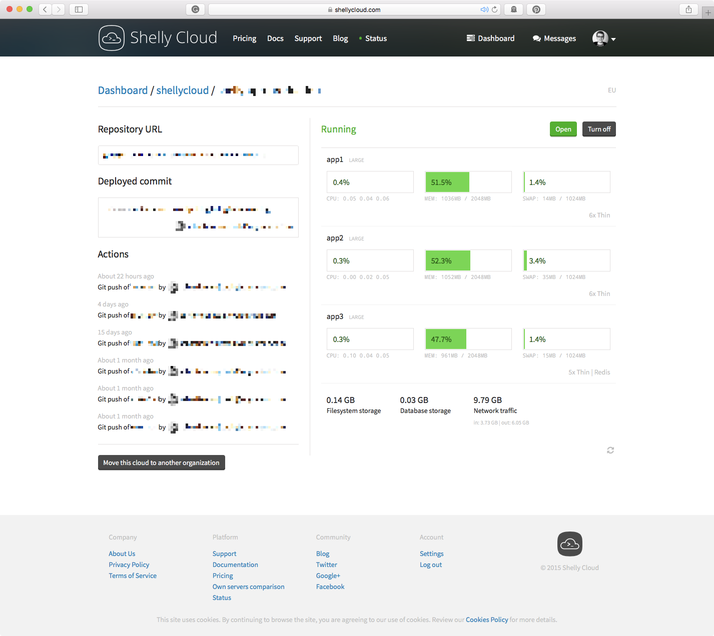

This is the second post of the series on our blog, in which I'll present to you the part of our infrastructure that is visible to the users. Here you can find links to past and, when we publish them, future posts:

READMORE

* [Part I - Overview of the stack][part1]
* [Part II - Gem and web interface][part2]
* Part III - API
* Part IV - Architecture, servers, and virtualization

## Cloudfile & Git

[Cloudfile][cloudfile] is our solution to manage application environments, server layout, and services. Basically, it's a YAML file stored in the project's repository. We parse it during the deployment.

Upsides:

1. Convention of a single file where you can always find server layout. A concept similar to Gemfile, Rakefile etc.
2. Very easy to understand and manage. There is no problem when you need to add a new service like a new database or increase the number of servers.
3. Cloudfile is included in a repository, so it's simple to track the history of infrastructure changes.

Downsides:

1. Hard to implement a handy interface for auto-scaling (we plan to do that someday).

Deployment is handled by Git. Developer runs deployment and update code on remote machines by plain `push` command. On our side, to make it work we don't use anything more than Git hooks. Repositories storage is replicated and backed up daily.

## Shelly Gem

<figure>
  
</figure>
  
The main interface to interact with our platform is a CLI written in Ruby. We focus to allow customers to do everything from the shell. That's why we are called Shelly Cloud.

Our gem is named `shelly` and hosted as many other gems on RubyGems, and [it's open sourced][shelly].

Actions available in gem:

1. Setting up user's account, clouds and organizations;
2. Managing databases, file storage, backups, access to clouds, application logs, deployment logs, configuration files, IP endpoints;
3. Cloud statistics;
4. Application console and dbconsole (like mongoconsole or redis-cli);
5. Connecting to virtual servers by SSH;
6. Setting up a tunnel to database;
7. Planning any maintenance.

Our gem is built on top of the Thor framework. It's good enough for our needs, but we wouldn't use it again. Anyway, we don't plan to rewrite the CLI now. The biggest issues which we had:

1. Thor generates a wrong help message for subcommands
2. Customers try to include our gem in Rails app Gemfile. Thor doesn't work well then. We have to validate that.
3. Missing action hooks

Communication with API is managed by rest-client. We don't have any special feelings about this, it just works.

For test purposes, we use RSpec with the addition of [fakefs][fakefs] gem which simulate a file system and [fakeweb][fakeweb] gem to mock web requests.

## Web interface - shelly-app

<figure>
  
</figure>

Our web interface is a regular Rails application, running on the newest available version, 4.2.x. One specific thing is the lack of a database, everything is done with API. Shelly-app is hosted on Shelly Cloud itself.

We use web app to:

1. Display landing page, pricing, documentation, contact details and blog
2. Manage billing details
3. Manage user account
4. Start/stop clouds
5. Display statistics

As a template language, we use [slim][slim]. Stylesheets are generated from SASS files and we use [inuit.css][inuit] as a CSS starter kit. Angular handles our JavaScript, but we didn't implement routing. We only use Angular's directives as HTML components.

To manage external frontend libraries we use [rails-assets][rails-assets].

In backend to communicate with the API we use a gem called [her][her].

Our blog is built on top of the library called [postmarkdown][postmarkdown]. We've added to it a custom implementation of the archive.

From external tools, we have integrated [Intercom][intercom] to manage emails and provide support. [Swiftype][swiftype] to search documentation. [New Relic][new-relic] for server monitoring. [Fontello][fontello] for custom font icons.

We have a handy set of tools for development. This is a list of libraries which we use daily: [autoprefixer][autoprefixer], [quiet_assets][quiet-assets], [better_errors][better-errors], [rack-livereload][rack-livereload] and [guard-livereload][guard-livereload].

Last but not least, popular nowadays is a set of tools to test our Rails app: RSpec, [Jasmine][jasmine] and [Capybara][capybara].

[part1]: https://blog.ragnarson.com/2015/06/15/how-we-built-ruby-pass-part-i-overview-of-our-stack
[part2]: https://blog.ragnarson.com/2015/09/18/how-we-built-ruby-pass-part-ii-gem-and-web-interface
[cloudfile]: https://shellycloud.com/documentation/cloudfile
[shelly]: http://github.com/shellycloud/shelly
[fakefs]: https://github.com/defunkt/fakefs
[fakeweb]: https://github.com/chrisk/fakeweb
[slim]: https://github.com/slim-template/slim
[inuit]: https://github.com/csswizardry/inuit.css/
[rails-assets]: http://rails-assets.org
[her]: https://github.com/remiprev/her
[postmarkdown]: https://github.com/ennova/postmarkdown
[intercom]: https://intercom.io
[swiftype]: https://swiftype.com
[new-relic]: http://newrelic.com
[fontello]: http://fontello.com
[autoprefixer]: https://github.com/postcss/autoprefixer
[quiet-assets]: https://github.com/evrone/quiet_assets
[better-errors]: https://github.com/charliesome/better_errors
[rack-livereload]: https://github.com/johnbintz/rack-livereload
[guard-livereload]: https://github.com/guard/guard-livereload
[jasmine]: https://github.com/jasmine/jasmine
[capybara]: https://github.com/jnicklas/capybara
