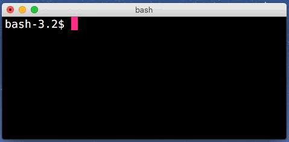
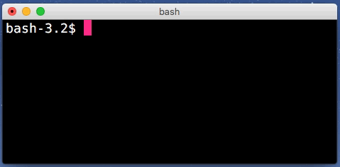
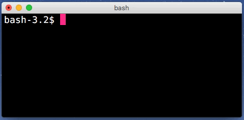
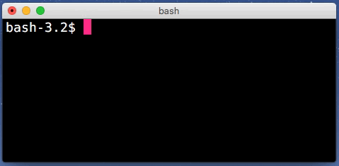

Last weekend I watched a really enjoyable talk about the [Readline editor
by George Brocklehurst](https://www.youtube.com/watch?v=MxRTh8wlmJk).
It interested me enough to do some extra investigation.
This article shares the results of my little research.

READMORE

What is Readline? In one sentence, it's an inline text editor extracted from
GNU Bash. You're using it every time you type things in the Unix shell.
Its implementation is widespread, used by other software like IRB, well-known
to Ruby programmers.

*If you are a Z shell user you need to know that zsh has its own library,
similar to Readline, called ZLE (Zsh Line Editor). This means that key
shortcuts won't work in the same way they do in Bash, and configuration
is totally different.*

## Config file

Readline has some interesting additional options that are disabled by default.
To enable them you should create an `.inputrc` file in your home directory and
put your settings there. Below is an example configuration file with
some explanations:

```shell
# always expand `~` to user's directory full path
set expand-tilde on

# show extra information in the output, similar to `ls -F`
set visible-stats on

# make autocomplete case-insensitive
set completion-ignore-case on

# immediately show the completions list
set show-all-if-ambiguous on
set show-all-if-unmodified on

# add a trailing slash to symlinked directories
set mark-symlinked-directories on

# disable the "-- more --" prompt for long lists
set page-completions off

# show the "Display (...) possibilities?" prompt only for long lists
set completion-query-items 400

# disable the sound bell
set bell-style none

# edit a long command line in a single screen line
set horizontal-scroll-mode on
```

## Keyboard shortcuts

Firstly, make sure that you have enabled meta key support in your terminal
preferences, OS X Terminal doesn't do this by default. This special key,
usually the left “alt” on the keyboard, is used for some key shortcuts.

Secondly, you can switch editing mode from emacs to vim, just add the
following line to inputrc: `set editing-mode vi`. In my opinion, the emacs
mode is more natural and handier, even for the vim users. This is a list of the
most useful bindings:

```shell
ctrl-w # delete the previous word
```


```shell
ctrl-_ # undo the last editing
ctrl-y # paste the last deleted word
```


```shell
ctrl-a # move the cursor to the start of the line
ctrl-e # move the cursor to the end of the line
```



```shell
meta-b # move the cursor one word backward
meta-f # move the cursor one word forward
```



```shell
meta-t # swap the places of the last two words
```


```shell
ctrl-meta-y # paste the first argument of the last executed command
meta-_ # paste the last argument of the last executed command
```



And that's all. If this topic seems interesting to you, check out these links:

- [George Brocklehurst talk](https://www.youtube.com/watch?v=MxRTh8wlmJk)
- [Readline documentation](http://cnswww.cns.cwru.edu/php/chet/readline/rluserman.html)
- [More keyboard shortcuts](http://www.bigsmoke.us/readline/shortcuts)
- [ZLE documentation](http://zsh.sourceforge.net/Doc/Release/Zsh-Line-Editor.html)
