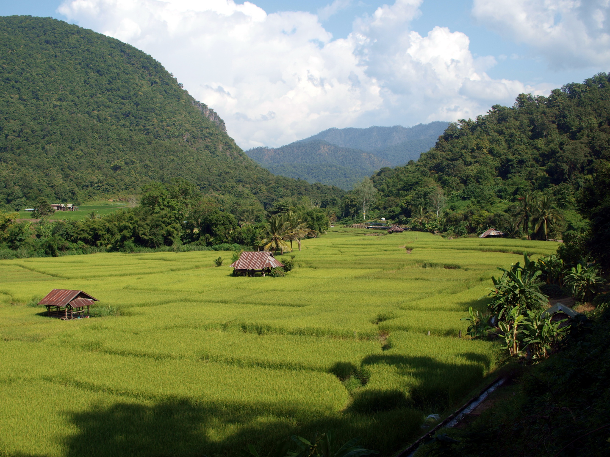
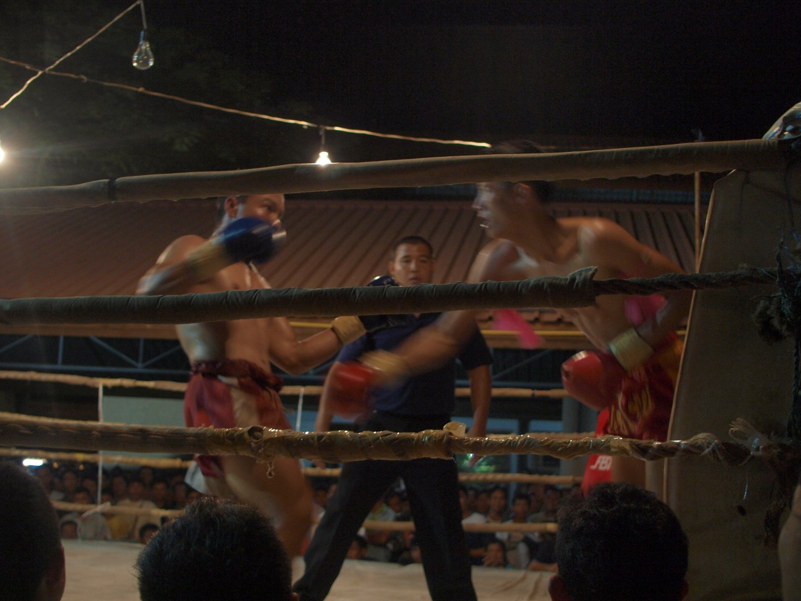
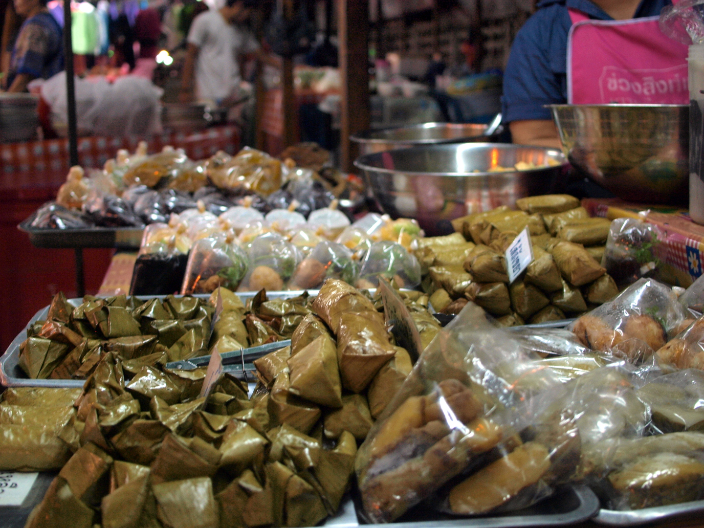

My favourite definition of the term [digital nomad](https://en.wikipedia.org/wiki/Digital_nomad) is *'Someone who flies across half the globe to look for good wifi in Starbucks'*.

Working remotely comes with a lot of perks. Deploying to production in your pyjamas or fixing a critical bug while sipping coffee in your favourite bar may sound appealing, however, having worked more than a year remotely, I still had the feeling that I wasn't making the most of it. Recently I decided to give something more *extreme* a try. Continue working while travelling in Thailand? Why not?

READMORE

Thailand is a world leader on the list of best places to live and work remotely on [nomadlist.com](https://nomadlist.com). Still, I had tons of doubts and worries about trying to work from such an exotic spot. However, to make the most of my one-month visa allowance I had no choice but to give it a try. I ended up working for about 2 weeks during my one month stay there.

In the end, most of my worries turned out to be false.

<figure>

<figcaption>
Rice fields just around the corner.
</figcaption>
</figure>

## Do they even have the internet there?

Maybe not presence but rather quality of available connection was something I was worried about. It turned out that on the mainland internet was always decent. Even when working from the hostel lobby, with tens of people posting their travel selfies on the same wifi. In my job as a developer, google hangouts with video streaming are the most internet demanding things to do. In the worst case, your co-workers will have to do without seeing your pretty face for some time. Sound-only calls were always ok.

The only places I had trouble finding a decent internet connection were the small Thai islands. Some of them did not even have electricity for most of the day. I ended up visiting them on weekends.

## Where will I work from?

I lived in all kinds of budget places, from cockroach-infested beach bungalows to tidy, air-conditioned hostel rooms. I never had a problem finding a corner to sit with my laptop. With the advent of smartphones, internet cafes are becoming less common. However, almost all of the bars and restaurants offer free wifi for their customers. What worked for me was to order a coffee and ask the owner if I can sit for a couple of hours to do *my computer things*. They were always ok with it, and even happier if I ordered lunch in the same place. I also used to work from tourist agencies, who were always fond of earning a few extra baht for lending me their wifi and a chair. I never paid more than the equivalent of 2€ for a day of work. In most of the hostels, I had no problem connecting to wifi in my room. If you would like to find a less random place to work from you can check out [www.sharedesk.net](https://www.sharedesk.net).

<figure>

<figcaption>
Just one more commit and I am off to see Thai boxing.
</figcaption>
</figure>

## Different timezone will be a big problem.

Because of the +6h time difference I used to start working in the afternoon to stay in sync with the rest of the team. It seemed like a pain in the beginning, but I got used to it right away. Hitting a beach on a motorbike in the morning, and then working until evening became a fun routine for me.

## Bad guys will steal my laptop.

Showing off with your fancy MacBook in the hostel lobby might attract some unnecessary attention. Just make sure to ask staff for a locker when you leave your room. I also wouldn't recommend strolling around Bangkok downtown at midnight with a laptop in your hand. Apart from that, you should be fine. If you are still superworried about losing your precious work tool, you might consider insuring it on [www.worldnomads.com](https://www.worldnomads.com).

## Will I be able to focus and do some actual work?

The hardest part was to leave a sunny beach with azure water and start heading to the *office*. It is difficult for me to judge, but I had the feeling that I was even more productive than normally. Maybe it was the feeling that if I screw up working this way it will be more difficult to try this whole *nomading* thing again? Maybe travelling gives you a positive boost and another perspective to look at even the code related problems? Anyway, a couple of bug-free commits went live to production straight from Asia and everyone was happy.

<figure>

<figcaption>
The best 1€ lunch ever.
</figcaption>
</figure>

## Summing up

I've visited a ton of beautiful places, tasted amazing food, and had a great time. Overall, my daily expenses were more or less the same or even smaller compared to living in Poland. But here I rarely treat myself with stuff like scuba diving trips and Thai massages. After trying *digital nomading* for the first time, I am already looking forward to doing it again. Have you ever worked like that and know some other cool places worth checking out? Let me know in the comments.

Everyone in the Ragnarson team works remotely but we have two offices in Łódź and Sopot you can always use. It gives you the best of both: a home-office routine if you need to, and all the freedom to see the world if you want to. And btw. yes [we are hiring](http://jobs.ragnarson.com).
