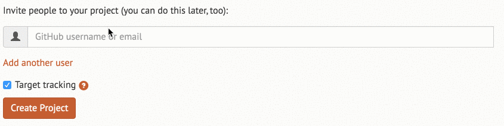
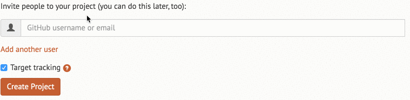

Adding simple, easy to customize and reliable autocomplete functionality has always been one of the topics that I thought wasn't very clear for Rails applications. During my last project, I finally decided that I would do some serious research and find one solution that I could use later without hesitation. And here it is: my choice is to use Twitter [typeahead.js](https://twitter.github.io/typeahead.js/) library.

READMORE

## Installing Typeahead

There are several gems that integrate the typeahead plugin with the Rails assets pipeline. I decided to use [the one](https://github.com/Nerian/bootstrap-typeahead-rails) which also provides basic styling for bootstrap. To get started simply add:

```ruby
gem 'bootstrap-typeahead-rails'
```

to your Gemfile and run bundle install. Next you will need to require necessary libraries in your app/assets/javascripts/application.js:

```js
//= require bootstrap-typeahead-rails
```

and styling in app/assets/stylesheets/application.css:

```css
*= require bootstrap-typeahead-rails
```

Unfortunately, we still need some custom css to work properly with input-group classes used in forms, but it's pretty simple and straightforward. You can just copy and paste it:

```css
span.twitter-typeahead
  width: 100%

.input-group
  span.twitter-typeahead
    display: block !important
    .tt-dropdown-menu
      top: 32px !important
      width: 100%
```

## Implementing autocomplete

We will provide simple autocomplete to one of the text fields. We want to search all users by their name, email or github account. To achieve this, we will use Bloodhound, the typeahead suggestion engine. Let's start with creating new file users.js.coffee:

```coffee
 ->
  initialize_users_typeahead = ->
    users_typeahead = new Bloodhound(
      datumTokenizer: Bloodhound.tokenizers.obj.whitespace(
        "name", "email", "github_username"
      ),
      queryTokenizer: Bloodhound.tokenizers.whitespace,
      prefetch: "/users/autocomplete"
    )

    users_typeahead.initialize()
```

- datumTokenizer basically tells us what fields we want to search by. So here we specify that we want to search by name, email and github_username from our autocomplete data. We will provide the data later.
- Prefetch fetches data and processes it on initialization, so it hits a given route only once and populates the needed data. It's then cached in local storage. For more complicated cases, you could also use the remote option instead of prefetch.

Now we need to initialize autocomplete on our text field, so let's say we will give it a `js-user-autocomplete` class and use it in our coffescript file as follows:

```coffee
$(".js-user-autocomplete").typeahead null,
  displayKey: "email"
  source: users_typeahead.ttAdapter()
```

- displayKey is just a value we want to display in our text field after selecting one of the options.

The last things to do is to create a new route for the prefetch option:

```ruby
get "users/autocomplete" => "users#autocomplete"
```

and action in controller where we provide data:

```ruby
def autocomplete
  users = User.all.map do |user|
    {
      name: user.name,
      email: user.email,
      github_username: user.github_username
    }
  end

  render json: users
end
```

Let's say we got 3 users in our database, shall we see how it works:



Cool, it works! But wait a minute, why do we see that test@test.org user when we type "dawid"? The answer is simple, we are searching not only by email but also by user name and github username. It's a little bit misleading right now.

What can we do to improve user experience?

## Adding custom handlebars.js template

Typeahead gives us full control over how suggestions are rendered. If we want to customize the look, we can provide a html template. For more complicated cases, we can use handlebars.js templates which will be rendered in place of suggestions. Firstly, add [the gem](https://github.com/leshill/handlebars_assets) needed and run bundle install:

```ruby
gem 'handlebars_assets'
```

Then add it to the application.js file:

```js
//= require handlebars
```

We want to display all the user's information we search by, but only if it's available (some users may not provide their name or don't connect their github account). The whole thing is very easy to achieve, we just need to add a templates option when initializing autocomplete, so our final version of users.js.coffee looks like this (notice templates option):

```coffee
$ ->
  initialize_users_typeahead = ->
    users_typeahead = new Bloodhound(
      datumTokenizer: Bloodhound.tokenizers.obj.whitespace(
        "name", "email", "github_username"
      ),
      queryTokenizer: Bloodhound.tokenizers.whitespace,
      prefetch: "/users/autocomplete"
    )

    users_typeahead.initialize()

    $(".js-user-autocomplete").typeahead null,
      displayKey: "email"
      source: users_typeahead.ttAdapter()
      templates:
        suggestion: Handlebars.compile("
          <div>
            {{#if name}}
              Name: <strong>{{name}}</strong>
            {{/if}}
            {{#if email}}
              Email: <strong>{{email}}</strong>
            {{/if}}
            {{#if github_username}}
              Github username: <strong>{{github_username}}</strong>
            {{/if}}
          </div>
        ")

  initialize_users_typeahead()
```

Does it work as expected? Hell yeah!



Now we can see why the "test@test.org" user was visible earlier - his name is Dawid Doe and we don't see any name or github username if it isn't available.

## Wrapping Up

The whole autocomplete thing using typeahead may seem a little bit complicated at first glance, but all in all, there are just some concepts that have to be understood and adjusted to the current feature. We need to figure out how Bloodhound works, maybe integrate it with handlebars.js, but future implementations in other projects will be really easy and differentiated only with search logic and suggestion template. The concepts stay the same.
