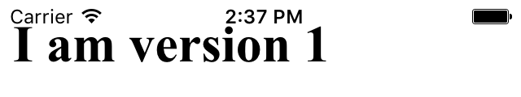
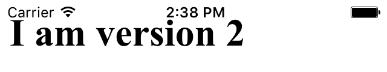
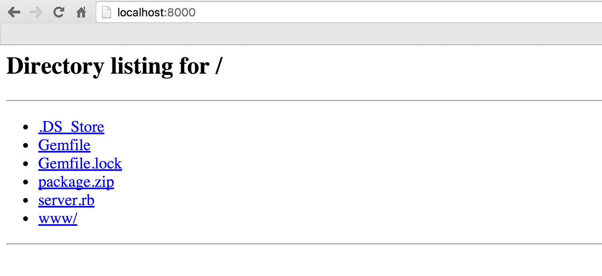
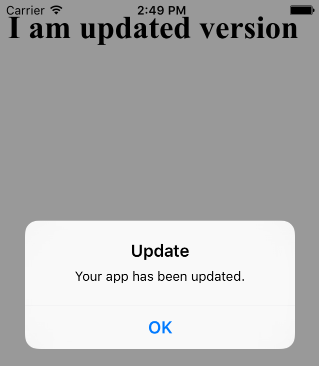

One of the many advantages of a hybrid approach to mobile apps development is instant code updates. In this article, I will guide you through setting up a basic updates mechanism from scratch. With little adjustment it will work for every [Cordova](https://cordova.apache.org/) ([PhoneGap](http://phonegap.com/), [Ionic](http://ionicframework.com)) iOS project. You can follow the steps or download a [complete github repo](https://github.com/pawurb/cordova-instant-updates) to tinker with it yourself. Some basic Objective-C knowledge will be necessary to follow the guide.

READMORE

For backend development releasing a new version is often as easy as doing a git push. On the contrary, submitting a new version to the App Store, with all the iTunes Connect bureaucracy and review waiting time is sometimes difficult to cope with. On Android it takes a couple of hours for a new version to go live on production. iOS review time can take anything [from a couple of days to ~3 weeks](http://appreviewtimes.com/). In theory, you can request an expedited review, however, this is normally reserved for urgent bug fixes and cannot be overused.

For iOS apps, all the compiled native code must not be changed after submitting the app to review. However [point 3.3.2](https://developer.apple.com/programs/ios/information/iOS_Program_Information_4_3_15.pdf) of the iOS Developer Program Information explicitly states that *code downloaded and run by Apple's built-in WebKit framework or JavascriptCore* can be updated without all the 3-week-long review hassle.

We've been using this approach in the production of our app for almost a year now. Overall it works without problems, apart from a few minor caveats I will mention later.

I will be using the newest Cordova by the time of writing (5.4.1). The steps should be identical for other versions.

### Initial setup

Let's start with generating a new iOS Cordova project:

``` bash
cordova create hot_updates
cd hot_updates
cordova platforms add ios
echo "<html><body><h1>I am version 1</h1></body></html>" > www/index.html
cordova build ios
```

Now open the xCode project from `platforms/ios` in the xCode and run it to make sure there are no errors and you can see the correct `index.html` rendered:

<figure>

</figure>

By default, Cordova keeps all the html assets in the application bundle. It is not writable and cannot be changed after submitting the app to review. To enable instant updates, you need to change the resource path for Cordova assets.

Open the following file: `platforms/ios/CordovaLib/Classes/CDVCommandDelegateImpl.m`

and change

``` swift
- (NSString*)pathForResource:(NSString*)resourcepath
```

method to look like this [(source)](http://stackoverflow.com/questions/12865316/phonegap-updating-javascript-and-css-without-submitting-the-app-to-appstore):

``` swift
- (NSString*)pathForResource:(NSString*)resourcepath
{
    NSArray *searchPaths = NSSearchPathForDirectoriesInDomains(NSDocumentDirectory, NSUserDomainMask, YES);
    NSString *wwwFolderName = [NSString stringWithFormat:@"%@/www", [searchPaths firstObject]];
    NSBundle* mainBundle = [NSBundle mainBundle];
    NSMutableArray* directoryParts = [NSMutableArray arrayWithArray:[resourcepath componentsSeparatedByString:@"/"]];
    NSString* filename = [directoryParts lastObject];

    [directoryParts removeLastObject];

    NSString* directoryPartsJoined = [directoryParts componentsJoinedByString:@"/"];
    NSString* directoryStr = wwwFolderName;

    if ([directoryPartsJoined length] > 0) {
        directoryStr = [NSString stringWithFormat:@"%@/%@", wwwFolderName, [directoryParts componentsJoinedByString:@"/"]];
    }

    if (![wwwFolderName isEqualToString:@"www"]) {
        return [NSString stringWithFormat:@"%@/%@",wwwFolderName,@"index.html"];
    }

    return [mainBundle pathForResource:filename ofType:@"" inDirectory:directoryStr];
}
```

Save and run your project again. You should see a white screen. Now let's put some assets in the new path.

To minimize Cordova code customization we will put all the remaining code for code updates in one class. First let's add a class responsible for this to the xCode project. Right click on `Classes` group and select `New file` of type `Cocoa Touch Class` call it `CodeUpdater` and make it a `NSObject` subclass.

Now open `platforms/ios/HelloCordova/Classes/AppDelegate.m` and add the import statement to the beginning of the file.

```swift
#import "CodeUpdater.h"
```

We want to check for the new updates every time the app is launched or woken up from background mode. Therefore, add the following line:

``` swift
[[[CodeUpdater alloc] initWithViewController:self.viewController] call];
```

to the end of:

``` swift
- (BOOL)application:(UIApplication*)application didFinishLaunchingWithOptions:(NSDictionary*)launchOptions
```

AppDelegate method. Just before the `return YES;` statement.

Also add the following method:

``` swift
- (void)applicationWillEnterForeground:(UIApplication *)application {
    [[[CodeUpdater alloc] initWithViewController:self.viewController] call];
}
```

Your code will now fail to compile because you did not add the correct initializer and public method to the `CodeUpdater` class yet. Change the `CodeUpdater.h` file to look like this:

```
#import <Foundation/Foundation.h>
#import "MainViewController.h"

@interface CodeUpdater : NSObject

- (instancetype)initWithViewController:(CDVViewController *)viewController;
- (void)call;

@end
```

Also, let's add some placeholder intializer and call method to `CodeUpdater.m`:

```
#import "CodeUpdater.h"

@implementation CodeUpdater
    - (instancetype)initWithViewController:(CDVViewController *)viewController {
      self = [super init];
      return self;
    }

    - (void)call {
    }
@end
```

Now your project should compile again.

To keep code examples simpler, we will skip semantic versioning here and just use plain integers to mark updates. If you want to do a proper semantic versioning, I recommend the following library: [semver](https://github.com/thisandagain/semver).

Anyway, we will need to add a couple of libraries, both external and system, that hot updates depend on.

Let's start by importing:

* [AFNetworking](https://github.com/AFNetworking/AFNetworking)
* [ZipArchive](https://github.com/ZipArchive/ZipArchive)

Unfortunately Cordova does not play well with Cocoapods. You'll have to follow the docs on how to import the libs manually, or just download the [sample repo](https://github.com/pawurb/cordova-instant-updates) where the libs are already included.

Now add the following system libraries in the xCode:

* libz.tdd
* SystemConfiguration.framework
* Security.framework

Then add import statements to the `CodeUpdater.m` file:

``` swift
#import "AFNetworking.h"
#import "SSZipArchive.h"
```

Try to compile again to make sure you imported everything correctly.

### Development mode

We have to implement the two cases of updates flow. For development mode we will be copying assets from the application bundle. This is where the `cordova build ios` command copies them so we want to apply our changes after each build. For production we will fetch JSON api info about the newest available assets version and the download update if available.

Let's start with the development mode. To distinguish between modes, we will simply add a static bool constant. In production you probably should move it to a configuration file but we will skip it here to keep the code simpler.

Edit `CodeUpdater.m` file to look like this:

``` swift
#import "CodeUpdater.h"
#import "AFNetworking.h"
#import "SSZipArchive.h"

static BOOL DEV_MODE = true;

@implementation CodeUpdater {
    NSFileManager *_fileManager;
    CDVViewController *_viewController;
}

    - (instancetype)initWithViewController:(CDVViewController *)viewController {
        _fileManager = [NSFileManager defaultManager];
        _viewController = viewController;
        self = [super init];
        return self;
    }

    - (void)call {
        if(DEV_MODE) { // 1
            [self copyBundleAssets];
        }
    }

    - (void)copyBundleAssets { // 2
        [_fileManager removeItemAtPath:[self writableAssetsPath] error:nil];
        [_fileManager copyItemAtPath:[self bundleAssetsPath] toPath:[self writableAssetsPath] error:nil];
    }

   - (NSString *)writableAssetsPath { // 3
        NSArray *paths = NSSearchPathForDirectoriesInDomains(NSDocumentDirectory, NSUserDomainMask, YES);
        NSString *documentsDirectory = [paths firstObject];
        [self addSkipBackupAttributeToItemAtURL:[NSURL fileURLWithPath:documentsDirectory]];
        return [documentsDirectory stringByAppendingPathComponent:@"/www"];
    }

    - (NSString *)bundleAssetsPath { // 4
        return [[[NSBundle mainBundle] resourcePath] stringByAppendingPathComponent:@"www"];
    }

    - (void)addSkipBackupAttributeToItemAtURL:(NSURL *)URL { // 5
        NSError *error = nil;
        [URL setResourceValue: [NSNumber numberWithBool: YES] forKey: NSURLIsExcludedFromBackupKey error: &error];
    }
@end

```

That's quite a lot of new code so let's explain:

1. If your app is in development mode you have to copy assets from the application bundle to the new path we've overwritten in `CDVCommandDelegateImpl.m` class.
2. using the NSFileManager instance, we remove the old assets and copy the new ones from the bundle.
3. this is the writable assets path location on the phone.
4. this is the path of the default application bundle
5. this method is needed to avoid problems with iCloud sync when your total assets size is more than 5MB.

You can validate that applied changes are visible after building and running the xcode project:

``` bash
echo "<html><body><h1>I am version 2</h1></body></html>" > www/index.html
cordova build ios
```

<figure>

</figure>

### Production mode

First, we will bootstrap a simple Sinatra server that will provide us with the JSON api. Alternatively, you can use any backend technology you are familiar with.

Create a `Gemfile` file in a separate `server` folder with the following contents:

``` ruby
source 'https://rubygems.org'
gem 'sinatra'
gem 'json'
```

then add a `server.rb`

``` ruby
require 'sinatra'
require 'json'

get '/' do
  content_type :json
  { version: 2, url: "http://localhost:8080/package.zip" }.to_json
end
```
and run it:

``` bash
bundle install
ruby server.rb
```

After going to `localhost:4567` in your browser you should see the correct JSON.

Now let's generate a new assets version that will be downloaded and unzipped to our mobile app. In the `server` folder execute the following commands:

``` bash
mkdir www
echo "<html><body><h1>I am updated version</h1></body></html>" > www/index.html
zip -r package.zip www
```

 We will use python `SimpleHTTPServer` to serve asset files locally.  On MacOS it should be preinstalled. Run:

`python -m SimpleHTTPServer`

<figure>

<figcaption>
Make sure it works on `localhost:8080` and all the files are served correctly.
</figcaption>
</figure>

On production, I recommend using [Amazon S3](https://aws.amazon.com/s3/) with [CloudFront](https://aws.amazon.com/cloudfront/).

iOS 9 introduced some http restrictions. If you want your app to communicate with endpoints not secured by SSL, you have to add the following code to `platforms/ios/HelloCordova/HelloCordova-Info.plist` file

``` xml
  <key>NSAppTransportSecurity</key>
  <dict>
    <key>NSAllowsArbitraryLoads</key>
    <true/>
  </dict>
```

You can read up on what it's all about [here](http://ste.vn/2015/06/10/configuring-app-transport-security-ios-9-osx-10-11/).

Now add the following code to `CodeUpdater.m`:

``` swift
#import "CodeUpdater.h"
#import "AFNetworking.h"
#import "SSZipArchive.h"

static BOOL DEV_MODE = false;
static NSString *API_URL = @"http://localhost:4567/";
static NSString *VERSION_KEY = @"currentVersion";

@implementation CodeUpdater {
    NSFileManager *_fileManager;
    AFHTTPRequestOperationManager *_http;
    NSString *_download_url;
    NSNumber *_version;
    CDVViewController *_viewController;
}

    - (instancetype)initWithViewController:(CDVViewController *)viewController {
        _fileManager = [NSFileManager defaultManager];
        _http = [AFHTTPRequestOperationManager manager];
        _http.requestSerializer = [AFJSONRequestSerializer serializer];
        _http.requestSerializer.timeoutInterval = 15;
        _viewController = viewController;
        self = [super init];
        return self;
    }

    - (void)call {
        if(DEV_MODE) {
            [self copyBundleAssets];
        } else {
            [self copyAssetsIfMissing];
            [self checkForUpdates];
        }
    }

    - (void) copyAssetsIfMissing { // 1
        BOOL assetsExists = [_fileManager fileExistsAtPath:[self writableAssetsPath]];
        if(!assetsExists) {
            [self copyBundleAssets];
        }
    }

    - (void)copyBundleAssets {
      ...
    }

    - (NSString *)writableAssetsPath {
      ...
    }

    - (NSString *)bundleAssetsPath {
      ...
    }

    - (void)addSkipBackupAttributeToItemAtURL:(NSURL *)URL {
      ...
    }

    - (void)checkForUpdates { // 2
        [_http GET:API_URL parameters: nil success:^(AFHTTPRequestOperation *operation, id response) {
            _version = ((NSDictionary *)response)[@"version"];
            _download_url = ((NSDictionary *)response)[@"url"];
            if(_version != (id)[NSNull null] && _download_url != (id)[NSNull null]) {
                if([_version integerValue] > [[self currentVersion] integerValue]) {
                    [self fetchNewVersion];
                } else {
                    NSLog(@"Version %@ is up to date", [self currentVersion]);
                }
            } else {
                NSLog(@"Missing version number info.");
            }
        } failure:^(AFHTTPRequestOperation *operation, NSError *error) {
            NSLog(@"ERROR: %@", error);
        }];
    }

    - (void)fetchNewVersion { // 3
        UIAlertView *popupDownloading = [[UIAlertView alloc]
                       initWithTitle:@"Update"
                       message:@"Your app is being updated."
                       delegate:nil
                       cancelButtonTitle:nil
                       otherButtonTitles:nil];

        NSLog(@"Downloading version %@ started", _version);
        NSURLRequest *request = [NSURLRequest requestWithURL:[NSURL URLWithString:_download_url]];
        AFHTTPRequestOperation *operation = [[AFHTTPRequestOperation alloc] initWithRequest:request];

        NSArray *paths = NSSearchPathForDirectoriesInDomains(NSDocumentDirectory, NSUserDomainMask, YES);
        NSString *path = [[paths objectAtIndex:0] stringByAppendingPathComponent:@"package.zip"];
        operation.outputStream = [NSOutputStream outputStreamToFileAtPath:path append:NO];

        [operation setCompletionBlockWithSuccess:^(AFHTTPRequestOperation *operation, id responseObject) {
            NSLog(@"Downloading version %@ to %@ completed", _version, path);
            NSString *zipPath = path;
            NSString *destinationPath = [[paths objectAtIndex:0] stringByAppendingPathComponent:@""];

            [SSZipArchive unzipFileAtPath:zipPath toDestination:destinationPath];
            [self setCurrentVersion:_version];
            [[NSURLCache sharedURLCache] removeAllCachedResponses];
            [_viewController.webView reload];
            [popupDownloading dismissWithClickedButtonIndex:0 animated:YES];
            UIAlertView *popupCompleted = [[UIAlertView alloc]
                        initWithTitle:@"Update"
                        message:@"Your app has been updated."
                        delegate:nil
                        cancelButtonTitle:@"OK"
                        otherButtonTitles:nil];
            [popupCompleted show];
            NSLog(@"WebView reloaded with a new version: %@", _version);
        } failure:^(AFHTTPRequestOperation *operation, NSError *error) {
            NSLog(@"ERROR: %@", error);
            [popupDownloading dismissWithClickedButtonIndex:0 animated:YES];
        }];

        [operation start];
     }

    - (NSNumber *)currentVersion { // 4
        NSUserDefaults *defaults = [NSUserDefaults standardUserDefaults];
        if(![defaults integerForKey:VERSION_KEY]) {
            [defaults setInteger:1 forKey:VERSION_KEY];
            [defaults synchronize];
        }

        return @([defaults integerForKey:VERSION_KEY]);
    }

    - (void)setCurrentVersion:(NSNumber *) version { // 5
        NSUserDefaults *defaults = [NSUserDefaults standardUserDefaults];
        [defaults setInteger:[version integerValue] forKey:VERSION_KEY];
        [defaults synchronize];
    }
@end
```

So let's run through what is going on with this:

1. If running the app for the first time in production mode our assets path will be empty. In case there is no newer version to download from the servers, it will remain empty and the app will be useless. To avoid this we check if bundle assets are already present in the Cordova assets path and, if not, then we copy them there.
2. Using `AFNetworking` library, we hit our JSON api and check if a newer version than the one installed locally is available.
3. If there is a new version available we download the zip package from the provided url. When download is initiated we display an informative popup. After the package is fully downloaded, we unzip it to the Cordova assets path, save the new version number to the `NSUserDefaults` and reload the `UIWebView` to apply changes.
4. This method returns the current version number. If none is present, we set the current version to 1.
5. This method lets us update the current version number.

Make sure both sinatra and python servers are running and execute the app.

<figure>

<figcaption>
You should see the popup and an assets version from the `package.zip` on the screen.
</figcaption>
</figure>

If you want to upload a new version just change the contents of the `package.zip` file and bump the version number in the sinatra server.

### Caveats

As I mentioned earlier there are some things to watch out for when using this approach:

* You cannot hot update native plugins like the ones used by [ngCordova](http://ngcordova.com/). Therefore, you have to be careful not to ship a version depending upon plugins which are not bundled in the app. We solved this problem by using semantic versioning and bumping the major version only during App Store releases.

* When using this mechanism for Ionic framework based apps I noticed that sometimes the template files used in UI router do not update even though a new version was downloaded. Looks like they are cached somewhere and so far I have failed to resolve it (tips are welcome). This can lead to serious bugs when JavaScript and template codes are incompatible. A hacky fix is to rename the template each time a new version is released, like `index.html --> index2.html`. Names can be reset when a new version is released through App Store.

### Final remarks

This mechanism has given us a significant boost for releasing the new features on time and fixing production bugs without expedited reviews. If you develop an Ionic app you can also look into [Ionic Deploy](http://docs.ionic.io/docs/deploy-from-scratch), however, by the time of writing it is still in beta, not recommended for production and will eventually be a paid service. Our hot updates were ready and working fine before it was even announced and we did not feel a need to switch.

With a bit more sophisticated backend side logic there is some cool stuff you can do with this mechanism:

* Incremental updates: The way this works, it that files in the Cordova assets path are overwritten by the new ones. In a package, you could only include things that changed and distribute updates of a couple of KB instead of MB.
* A/B testing: Publish a couple of versions and distribute them to clients randomly or in predefined proportions. Using in-app analytics with some version specific labelling can tell you which behaves the best.

But that's a story for another (huge) blogpost. Thanks for making it to the end and let me know if you have any questions. You can download a complete repo with both the xCode project and server side code from [here](https://github.com/ragnarson/cordova-instant-updates).


